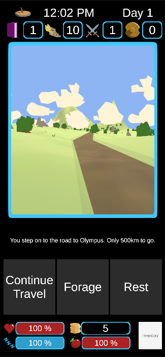
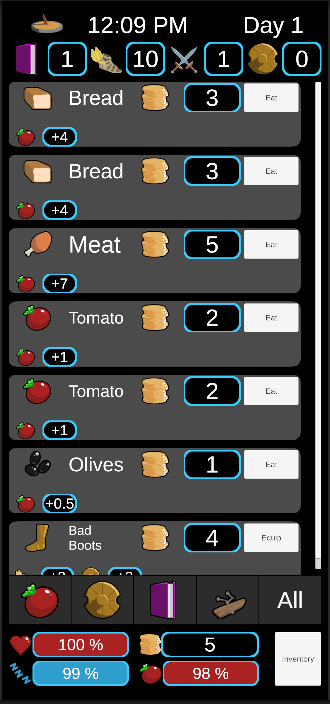
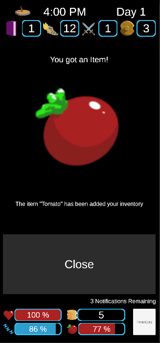
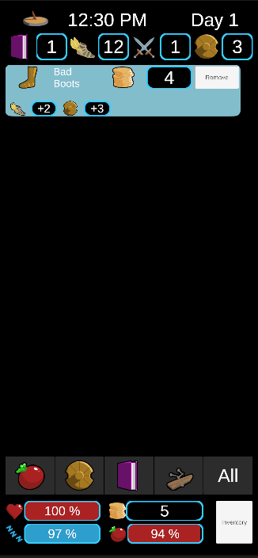

# Road to Olympus
## A Game Jam Game

This is the product of a 3 day game jam in early 2024, plus some time for some extra work. The project isn't really playable, but was a fun idea.

All the art and programming done by me.

## The Idea

You are a traveller from the times of the greek gods. You're making the pilgrimage to Mount Olympus, the seat of the gods, to ask for help (reason for help is currently unknown). The road is long and the dangers many, but with some deep cunning and a healthy dose of luck, you may make it.

I wanted it to play kind of like a text based RPG, with very simple graphics and UI to add some immersion.

## Things I'm Proud Of
- I really like the bar animations for the UI, it's a simple script that handles it but the effect adds a lot to the UX of the UI. The script can be found in "Assets/Scripts/UI/UIStat.cs".
- I like the terrain generation, I think it has a lot of potention if I sat down with a dedicated artist to make it look good. It has an appealing retro aesthetic, but I feel like it could be more. If I ever get around to adding villages and characters, I'll have to work hard to bring it up to its full potential.

## Mechanics
### Implemented
- Random map generation
- Random map decoration
- Inventory system
- Foraging
- Basic Resource Management (**Not at all balanced**)
- Travel
- Day/Night Cycle

### Planned
- Random Encounters
    - Travelling Merchants
    - Bandits
    - Mercenaries
    - Gods (Disguised and not)
    - Etc
- Special Map Tiles
    - Villages
    - Cities
    - Greek Myths (Special monster events)

## Screenshots

<video controls src="Screenshots/roadToOlympus-2025-08-29_19.59.56.mkv" title="Gameplay Video"></video>